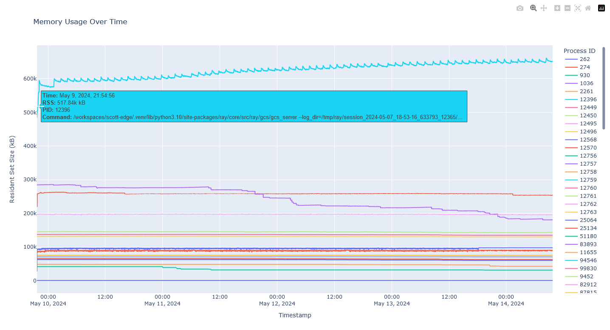

# Ray Memory Leak Repro

## Development Environment

This project uses [VS Code Dev Containers](https://code.visualstudio.com/docs/devcontainers/containers) to provide a reporoducible development environment.

When the project is opened in VS Code, it will prompt you to re-open the project in a container. Be sure to allow this.

When editing Python files, make sure that VS Code is using the poetry venv (`./.venv/bin/python3`). Otherwise it will fail to resolve third-party imports.

## Running the application from the dev container

Open a terminal in VS Code and run the following:

```bash
poetry run ray start --head --disable-usage-stats
poetry run python src/main.py
```

This will continuously invoke the `do_work` remote method on the `MinimalActor` actor, which simply increments the value of its `_counter` state.

To collect memory stats for relevant processes, open another terminal in VS Code and run the following:

```bash
./log-mem.sh
```

This will write to `memory_usage.log`. Let it run for a while before plotting the data so that you will get a meaningful trend.

To plot the data in `memory_usage.log`, use the `src/plot_mem.py` script as follows:

```bash
poetry run python src/plot_mem.py
```

This will create `output/plot.html`, which you can view in a web browser. Hovering the mouse over a line will reveal details, including the PID. Double-click the matching value in the Process ID legend to focus the chart on just that process. Single-click individual Process IDs to toggle their visibility.

## Observations



We ran this for about 166 hours and observed a continuous overall increase in the peak memory usage of the `ray/core/src/ray/gcs/gcs_server` process. Values of the peaks increased from an initial value of ~595 MB to ~662 MB over that period. That works out to roughly 403 KB per hour.
